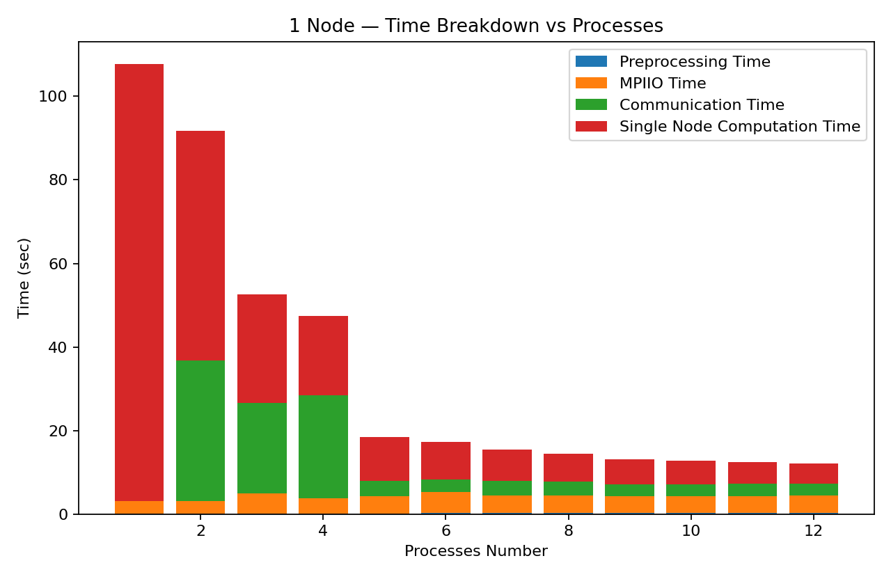
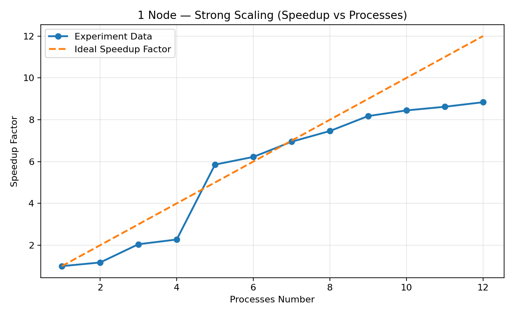
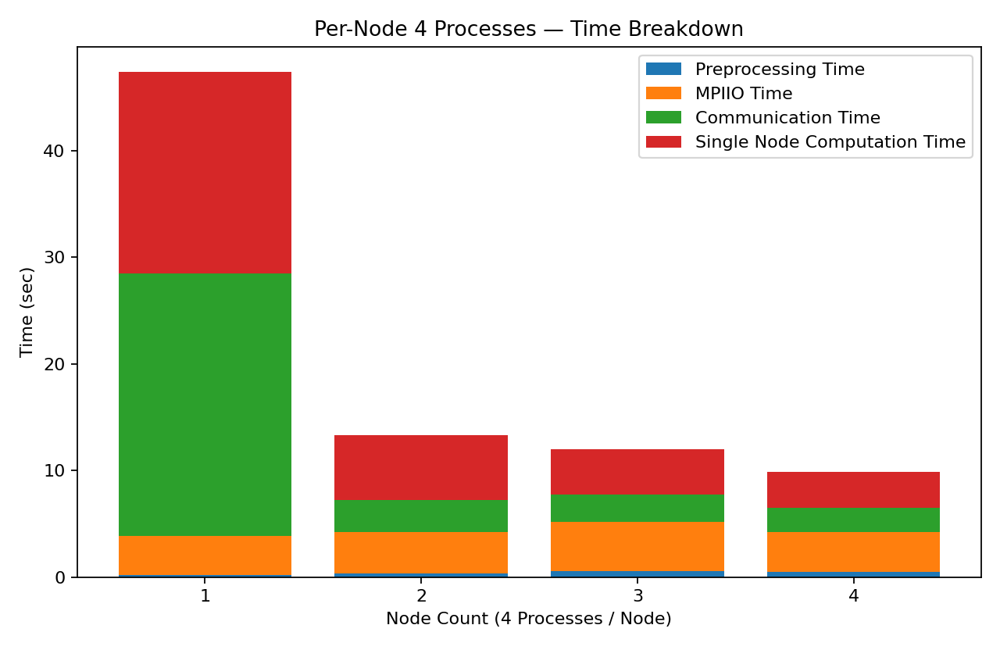
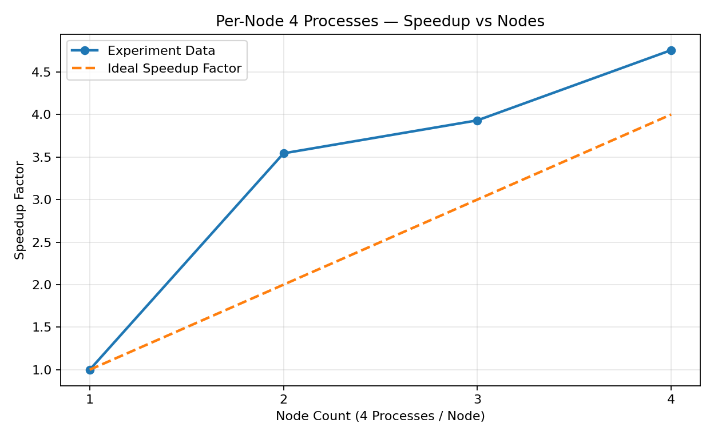
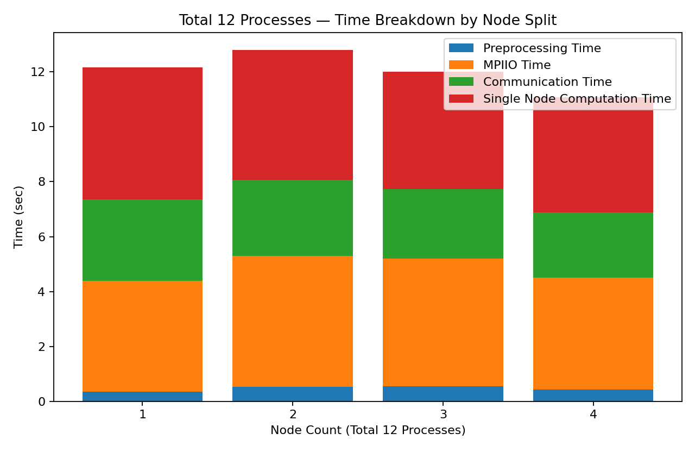
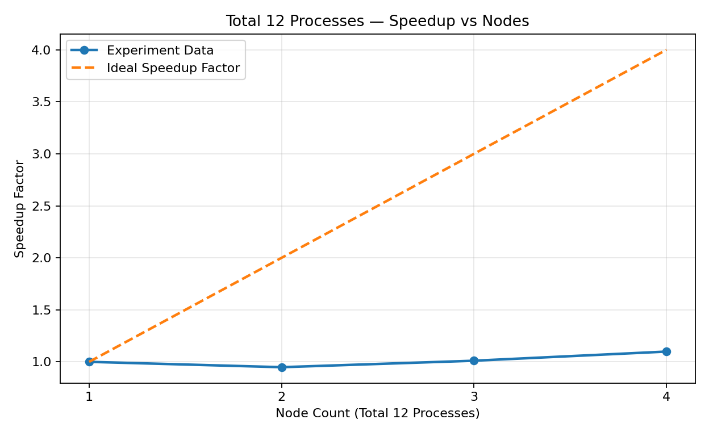

# Parallel Programming Homework 1: Odd-Even Sort
**姓名**：王子銜
**學號**：114062584

## 1. Introduction
本作業實作 Odd-Even Sort 的平行化版本，並以 MPI 在多節點環境測試效能與可擴展性。量測方法以 Nsight Systems (`nsys`) 蒐集 MPI 事件，再以分析腳本分解各階段時間（Preprocessing、I/O、Communication、Computation），最後繪製多組配置的時間剖面與加速比（Speedup）圖。

---

## 2. Implementation

### 2.1 程式主要流程
1. **初始化與讀檔**：`MPI_Init` → `MPI_File_open/read_at/close`  
2. **區段分配**：依 `N` 與 `size`（總 ranks）切齊負載，計算每個 rank 的 `(S, len)` 與鄰居的負載（`ranktable`）。  
3. **區段內排序**：使用 `boost::sort::spreadsort::spreadsort` 先行就地排序每個 rank 的區段。  
4. **Odd-Even 交換迭代**：執行至多 `size` 回合，每回合依奇偶決定與左右鄰居交換：  
   - 先用 `MPI_Sendrecv` 交換邊界元素判斷是否需要真正交換；  
   - 若需要，再以 `MPI_Sendrecv` 交換整段，並做 **merge**（小端/大端分別使用 `merge_small`/`merge_large`，並對已排序端做 `memcpy` 快速拷貝）。  
   - 每回合彙整 `local_flag`，在第 `times > size` 後以 `MPI_Allreduce(..., MPI_LOR, ...)` 判斷是否已全域收斂。  
5. **寫檔與結束**：`MPI_File_open/write_at/close` → `MPI_Finalize`。

> 交換函式 `merge_and_update` 會先交換邊界值做 **early-exit**，避免不必要的全段交換；`ranktable` 用來支援不等長分塊（`N % size != 0`）且確保正確 merge。

### 2.2 關鍵程式碼片段（節錄）
```cpp
int merge_and_update(float *myarr, bool even, int rank, int size, MPI_Comm comm){
    int mylen = ranktable[rank], neighbor = (even ? (rank%2?rank-1:rank+1) : (rank%2?rank+1:rank-1));
    if (neighbor < 0 || neighbor >= size || mylen == 0 || ranktable[neighbor] == 0) return 0;

    // 先交換邊界判斷是否需要全段交換
    float edge_me = (rank < neighbor) ? myarr[mylen-1] : myarr[0], edge_nb;
    MPI_Sendrecv(&edge_me, 1, MPI_FLOAT, neighbor, 201, &edge_nb, 1, MPI_FLOAT, neighbor, 201, comm, MPI_STATUS_IGNORE);
    if ((rank < neighbor && edge_me <= edge_nb) || (rank > neighbor && edge_me >= edge_nb)) return 0;

    // 需要時交換整段並 merge
    MPI_Sendrecv(myarr, mylen, MPI_FLOAT, neighbor, 101, recvarr, ranktable[neighbor], MPI_FLOAT, neighbor, 101, comm, MPI_STATUS_IGNORE);
    return (neighbor > rank) ? merge_small(myarr, recvarr, rank, neighbor)
                             : merge_large(myarr, recvarr, rank, neighbor);
}
```

---

## 3. Measurement & Metrics

### 3.1 量測工具與流程
- 使用 `nsys profile` 對每次執行蒐集 `.nsys-rep`，再用：  
  - `nsys stats -r mpi_event_trace --format csv` 匯出事件 CSV。  
  - `analyze.py` 讀取 `nsys_csv/` 中所有 rank 的 CSV，統計各階段時間並輸出彙總至 `<nodes>_<procs>.txt`。  
  - `plot_from_txt.py` 解析所有 `.txt`，繪製六張圖。

### 3.2 指標定義（與分析腳本一致）
- **Preprocessing time**：第一次 `MPI_File_read_at_all`（或 `read_at`）之前的所有事件時間總和（各 rank 以本地事件相加近似）。  
- **Input time**：第一次 `read_at_all/read_at` 的 duration + 隨後第一個 `MPI_File_close` 的 duration（*作圖時使用各 rank **mean***）。  
- **Output time**：第一次 `write_at_all/write_at` 的 duration + 隨後第一個 `MPI_File_close` 的 duration（*作圖時使用各 rank **mean***）。  
- **Communication time**：`{MPI_Waitall, MPI_Allreduce, MPI_Barrier, MPI_[I]send, MPI_[I]recv, MPI_Send, MPI_Recv}` 的總和（*作圖時使用各 rank **mean***）。  
- **Computation time（估算）**：  
  \\[
  \\text{comp} = \\text{wall}_{\\text{rank}} - (\\text{pre} + \\text{input} + \\text{output} + \\text{comm})
  \\]
  以各 rank 計得之 comp，**取 mean/max/min**作報表（圖用 mean）。  
- **Total job wall-time（Speedup 用）**：所有 rank 的「最晚 `End` − 最早 `Start`」（全域牆鐘）。  
- **Speedup**：以各族群 baseline 的 `Total job wall-time` 為 \\(T_0\\)，各配置 \\(S = T_0/T\\)。  
  - A（單節點 strong scaling）與 B（每節點 4 rank、節點數↑ ⇒ 總 rank↑）的理想線為線性。  
  - C（總 rank 固定 12，只改節點數）理想線為常數 1（資源不變）。

> 堆疊圖採 **rank-mean**（呈現平均行為）；Speedup 採 **牆鐘時間（全域）**。

---

## 4. Experimental Setup

### 4.1 系統環境
- 平台：課程叢集 **apollo**（多節點、多核 CPU，MPI 運行）。  
- MPI：OpenMPI（叢集預設版本）。  

### 4.2 測資
- 使用測資 #40：大小 **536,869,888**（浮點數列），分割至各 rank。

### 4.3 批次腳本
- `run_bench.sh`：自動化執行三組配置並產生 `<nodes>_<procs>.txt`。  
- `convert_csv.sh`：將 `nsys_reports/*.nsys-rep` 轉為 `nsys_csv/*.csv`。  
- 每回合會清空 `nsys_reports/`（建議同時清 `nsys_csv/` 以避免殘留干擾）。

### 4.4 三組實驗族群
- **A：單節點 strong scaling**：`nodes=1`，`procs ∈ {1..12}`。  
- **B：固定每節點 4 ranks**：`ppn=4`，`nodes ∈ {1..4}` ⇒ 總 ranks ∈ {4,8,12,16}。  
- **C：總 ranks 固定 12**：`procs=12`，`nodes ∈ {1..4}` ⇒ 各節點分別 {12,6,4,3} ranks。

---

## 5. Results

### 5.1 A：單節點（Processes↑）
<div style="display:flex; flex-wrap:wrap; gap:12px; align-items:flex-start;">
  <figure style="flex:1 1 360px; margin:0;">
    
    <figcaption style="text-align:center; font-size:0.95em; margin-top:6px;">
      時間剖面（rank-mean）
    </figcaption>
  </figure>
  <figure style="flex:1 1 360px; margin:0;">
    
    <figcaption style="text-align:center; font-size:0.95em; margin-top:6px;">
      Speedup（牆鐘，理想線=線性）
    </figcaption>
  </figure>
</div>


**觀察**
- Processes 由 1→12，**Computation** 顯著下降；**I/O** 在小規模下降後受固定開銷限制，收斂於一常數階。  
- **Communication** 自 p≥2 出現，受同步與交換次數影響，不隨 p 線性上升。  
- Speedup 在 p≤6 有明顯提升，之後受 **I/O 主導** 逐步趨緩。

---

### 5.2 B：每節點固定 4 ranks（改變節點數）
<div style="display:flex; flex-wrap:wrap; gap:12px; align-items:flex-start;">
  <figure style="flex:1 1 360px; margin:0;">
    
    <figcaption style="text-align:center; font-size:0.95em; margin-top:6px;">
      時間剖面（rank-mean）
    </figcaption>
  </figure>
  <figure style="flex:1 1 360px; margin:0;">
    
    <figcaption style="text-align:center; font-size:0.95em; margin-top:6px;">
      Speedup（牆鐘，理想線=線性）
    </figcaption>
  </figure>
</div>


**觀察**
- 總計算資源隨節點數增加而提升，計算時間下降；  
- 跨節點的 **I/O 與網路** 造成非理想化折損，但仍有可觀加速；  
- Communication 佔比變化受 Wait/配對同步影響，並非單調增加。

---

### 5.3 C：總 ranks 固定 12（改變節點數量）
<div style="display:flex; flex-wrap:wrap; gap:12px; align-items:flex-start;">
  <figure style="flex:1 1 360px; margin:0;">
    
    <figcaption style="text-align:center; font-size:0.95em; margin-top:6px;">
      時間剖面（rank-mean）
    </figcaption>
  </figure>
  <figure style="flex:1 1 360px; margin:0;">
    
    <figcaption style="text-align:center; font-size:0.95em; margin-top:6px;">
      Speedup（牆鐘，理想線=常數 1）
    </figcaption>
  </figure>
</div>


---

## 6. Discussion

1. **I/O 成為主瓶頸**  
   - `read_at(_all)`/`write_at(_all)` 的固定開銷與 `close` 同步導致可擴展性受限；  
   - 大 p 時，計算已被壓低，I/O 佔比上升，Speedup 受限。  
2. **Odd-Even 演算法的同步成本**  
   - 每回合交換必須與鄰居同步，`MPI_Waitall/Allreduce/Barrier` 等會被**最慢 rank**主導；  
   - 載入不均或網路抖動，都會在 Wait 中放大。    
3. **可行優化方向**  
   - **非同步 I/O / 通訊** 重疊計算（`MPI_File_i*`, `MPI_Iallreduce`），但要注意 `Wait` 的分佈與 profiler 影響；  
   - 平行檔案系統參數（stripe size/count、I/O aggregator 數），降低 metadata/同步開銷；  
   - 交換前的 **early-exit** 判斷已做（邊界比較），可再加入**多次未變更則跳過**等啟發式；  
   - 若允許演算法變動，可用 **本地高效排序 + 有界全域交換** 或採樣式 repartition 減少回合數與資料移動。

---

## 7. Reproducibility

### 7.1 執行步驟（每回合）
```bash
./run_batch
```

### 7.2 繪圖
```bash
python3 draw.py  # 產生六張圖：A/B/C_* .png
```

---

## 8. Conclusion
本作業展示了 Odd-Even Sort 在多節點上的可擴展性：  
- 計算可藉由增加 ranks 顯著下降，但**I/O 與同步**逐步成為主瓶頸；  
- 單節點 strong scaling 在中小規模內仍能逼近線性；  
- 跨節點在總 ranks 固定時，理想速度應不變，實測則因 I/O/網路/同步開銷而下降。  
後續可由非同步 I/O/通訊與平行檔案系統調整著手，並評估更進階的資料重劃分策略，以減少迭代回合與等待時間。

---

## 9. Appendix

### 9.1 指標計算（`analyze.py` 摘要）
- `Preprocessing`：第一次讀檔前的事件加總；  
- `Input/Output`：第一次 `read_at(_all)`/`write_at(_all)` + 其後第一個 `File_close`；  
- `Communication`：Send/Recv/Isend/Irecv/Waitall/Barrier/Allreduce 的總和；  
- `Computation`：以 rank wall-time 扣除上列四者；  
- `Total job wall-time`：全域（最晚 End − 最早 Start）作為 Speedup 的 \\(T\\)。

### 9.2 圖片清單（請與實際輸出對應）
- `./img/A_single_node_times.png`  
- `./img/A_single_node_speedup.png`  
- `./img/B_4ppn_times.png`  
- `./img/B_4ppn_speedup.png`  
- `./img/C_12total_times.png`  
- `./img/C_12total_speedup.png`
